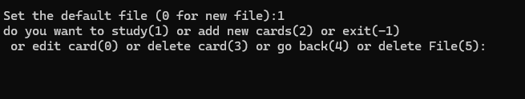

# Old-Projects-Python-Flash-Card-App
Using Pygame (a python library ) + Terminal to create a Flashcard game

part of plan to upload old projects, this project was created in 2017, it was used to study for classes.
## Choose File
#### study/edit flash cards or make new sets

## Study

